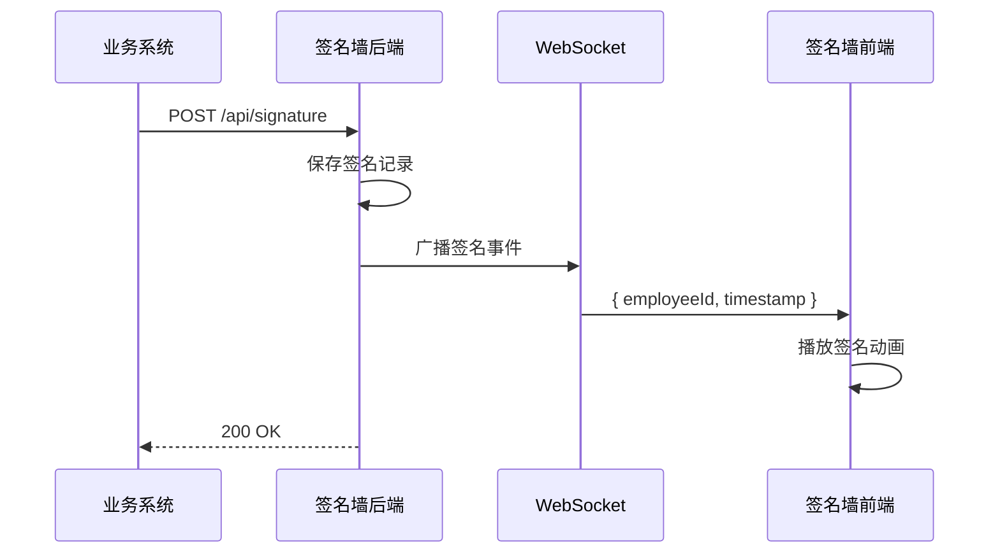

# SUNNY 签名墙 - 后端接口文档

> **版本**: v1.0  
> **更新日期**: 2026-01-31  
> **服务端口**: 3000（默认）

---

## 📋 目录

- [接口概览](#接口概览)
- [核心业务接口](#核心业务接口)
  - [1. 接收单个签名](#1-接收单个签名)
  - [2. 批量接收签名](#2-批量接收签名)
  - [3. 获取员工列表](#3-获取员工列表)
  - [4. 触发全员归位](#4-触发全员归位)
- [WebSocket 实时通信](#websocket-实时通信)
- [查询接口（可选）](#查询接口可选)
- [测试工具接口](#测试工具接口)
- [错误码说明](#错误码说明)
- [部署建议](#部署建议)

---

## 接口概览

SUNNY 签名墙系统通过 **WebSocket** 实现实时签名广播，后端需要提供以下核心接口：

| 接口         | 方法 | 路径                    | 用途             | 优先级         |
| ------------ | ---- | ----------------------- | ---------------- | -------------- |
| 接收签名     | POST | `/api/signature`        | 接收单个员工签名 | ⭐️⭐️⭐️ 必须 |
| 批量签名     | POST | `/api/signatures/batch` | 批量接收签名     | ⭐️⭐️ 推荐    |
| 获取员工列表 | GET  | `/api/employees`        | 返回参会员工列表 | ⭐️⭐️⭐️ 必须 |
| 触发归位     | POST | `/api/control/converge` | 大会结束时触发   | ⭐️⭐️ 推荐    |
| WebSocket    | WS   | `/signatures`           | 实时广播签名事件 | ⭐️⭐️⭐️ 必须 |

---

## 核心业务接口

### 1. 接收单个签名

**用途**: 当员工完成签名动作后，业务系统调用此接口通知签名墙系统。

#### 请求

```http
POST /api/signature
Content-Type: application/json
```

**请求体 (JSON)**:

```json
{
  "employeeId": "105001"
}
```

| 参数         | 类型   | 必填 | 说明                             |
| ------------ | ------ | ---- | -------------------------------- |
| `employeeId` | string | 是   | 员工工号，需与头像图片文件名一致 |

#### 响应

**成功 (200)**:

```json
{
  "success": true,
  "signature": {
    "id": 1,
    "employeeId": "105001",
    "timestamp": 1738315200000
  }
}
```

**重复签名 (409)**:

```json
{
  "error": "该员工已签名"
}
```

**参数缺失 (400)**:

```json
{
  "error": "缺少employeeId"
}
```

#### 重要说明

- ✅ 接收到签名后，后端需立即通过 **WebSocket 广播**通知所有已连接的前端客户端
- ✅ 系统会自动去重，重复签名返回 409 状态码
- ⚠️ `employeeId` 必须与服务器 `imgs/` 目录下的头像文件名（不含扩展名）一致

#### 示例调用

```bash
# cURL
curl -X POST http://your-server.com/api/signature \
  -H "Content-Type: application/json" \
  -d '{"employeeId": "105001"}'

# JavaScript (fetch)
fetch('http://your-server.com/api/signature', {
  method: 'POST',
  headers: { 'Content-Type': 'application/json' },
  body: JSON.stringify({ employeeId: '105001' })
})
```

---

### 2. 批量接收签名

**用途**: 适用于导入历史签名数据或批量补录场景。

#### 请求

```http
POST /api/signatures/batch
Content-Type: application/json
```

**请求体 (JSON)**:

```json
{
  "employeeIds": ["105001", "105002", "105003", "105010"]
}
```

| 参数          | 类型     | 必填 | 说明         |
| ------------- | -------- | ---- | ------------ |
| `employeeIds` | string[] | 是   | 员工工号数组 |

#### 响应

**成功 (200)**:

```json
{
  "success": true,
  "count": 4,
  "signatures": [
    {
      "id": 2,
      "employeeId": "105001",
      "timestamp": 1738315200100
    },
    {
      "id": 3,
      "employeeId": "105002",
      "timestamp": 1738315200102
    }
    // ... 其他签名记录
  ]
}
```

**参数错误 (400)**:

```json
{
  "error": "employeeIds必须是数组"
}
```

#### 重要说明

- ✅ 自动过滤已签名的工号（不会重复广播）
- ✅ 每个新签名都会独立广播 WebSocket 事件
- ⚠️ 建议每批次不超过 100 个工号，避免广播风暴

---

### 3. 获取员工列表

**用途**: 前端初始化时获取所有参会员工的工号列表。

#### 请求

```http
GET /api/employees
```

#### 响应

**成功 (200)**:

```json
{
  "employees": ["105001", "105002", "105003", "..."],
  "count": 300
}
```

| 字段        | 类型     | 说明         |
| ----------- | -------- | ------------ |
| `employees` | string[] | 员工工号数组 |
| `count`     | number   | 员工总数     |

**目录不存在 (404)**:

```json
{
  "employees": [],
  "count": 0,
  "error": "imgs directory not found"
}
```

#### 实现建议

**方案 1: 基于文件系统（推荐用于小规模）**

```javascript
// 从 imgs/ 目录扫描所有图片文件，文件名即为工号
const employees = fs
  .readdirSync('./imgs')
  .filter((f) => /\.(jpg|png|jpeg)$/i.test(f))
  .map((f) => path.parse(f).name)
```

**方案 2: 基于数据库（推荐用于大规模）**

```sql
SELECT employee_id FROM event_participants WHERE event_id = 'sunny_2026';
```

---

### 4. 触发全员归位

**用途**: 大会结束时，让所有头像汇聚成 "SUNNY" 字样。

#### 请求

```http
POST /api/control/converge
```

**请求体**: 无需参数

#### 响应

**成功 (200)**:

```json
{
  "success": true,
  "message": "已发送归位指令"
}
```

#### 实现逻辑

向所有已连接的 WebSocket 客户端广播：

```json
{
  "type": "converge"
}
```

前端收到后将自动触发头像归位动画。

---

## WebSocket 实时通信

**连接地址**: `ws://your-server.com/signatures`  
**用途**: 实时广播签名事件，让所有前端同步更新

### 消息格式

#### 1. 签名事件（服务端 → 前端）

```json
{
  "employeeId": "105001",
  "timestamp": 1738315200000
}
```

前端收到后会立即播放该员工的签名动画。

#### 2. 重置事件（服务端 → 前端）

```json
{
  "type": "reset"
}
```

用于测试环境重置签名墙。

#### 3. 归位事件（服务端 → 前端）

```json
{
  "type": "converge"
}
```

触发全员头像汇聚为 "SUNNY" 字样。

### 连接示例

**Node.js (ws 库)**:

```javascript
const WebSocket = require('ws')
const wss = new WebSocket.Server({ server, path: '/signatures' })

// 广播签名事件
function broadcastSignature(employeeId) {
  const message = JSON.stringify({
    employeeId,
    timestamp: Date.now()
  })

  wss.clients.forEach((client) => {
    if (client.readyState === WebSocket.OPEN) {
      client.send(message)
    }
  })
}
```

**Python (websockets 库)**:

```python
import asyncio
import websockets
import json

async def broadcast_signature(websocket_clients, employee_id):
    message = json.dumps({
        "employeeId": employee_id,
        "timestamp": int(time.time() * 1000)
    })

    await asyncio.gather(
        *[ws.send(message) for ws in websocket_clients]
    )
```

---

## 查询接口（可选）

以下接口用于监控和调试，生产环境可选实现。

### 获取所有签名记录

```http
GET /api/signatures/all
```

**响应**:

```json
{
  "signatures": [
    { "id": 1, "employeeId": "105001", "timestamp": 1738315200000 },
    { "id": 2, "employeeId": "105002", "timestamp": 1738315200500 }
  ],
  "total": 2
}
```

### 健康检查

```http
GET /health
```

**响应**:

```json
{
  "status": "ok",
  "signatures": 150,
  "connections": 5
}
```

---

## 测试工具接口

⚠️ **仅开发/测试环境启用，生产环境务必禁用！**

### 重置所有签名

```http
POST /api/signatures/reset
```

**响应**:

```json
{
  "success": true,
  "message": "已重置所有签名"
}
```

### 启动自动签名模拟

```http
POST /api/test/start-mock
```

系统会自动每 2 秒广播一个随机签名，用于演示。

**响应**:

```json
{
  "success": true,
  "message": "模拟签名已启动",
  "totalEmployees": 300
}
```

### 停止自动签名模拟

```http
POST /api/test/stop-mock
```

---

## 错误码说明

| HTTP 状态码 | 含义           | 常见原因                         |
| ----------- | -------------- | -------------------------------- |
| 200         | 成功           | -                                |
| 400         | 请求参数错误   | 缺少 `employeeId` 或格式不正确   |
| 404         | 资源不存在     | 员工列表接口无法找到 `imgs` 目录 |
| 409         | 冲突           | 员工已经签过名                   |
| 500         | 服务器内部错误 | 后端逻辑异常，需查看日志         |

---

## 部署建议

### 环境变量

```bash
PORT=3000                    # 服务端口
NODE_ENV=production          # 生产环境（禁用 Mock 工具）
SUNNY_ENABLE_MOCK=0          # 是否启用 Mock 接口（1=启用，0=禁用）
```

### 启动命令

```bash
# 生产环境
NODE_ENV=production PORT=80 node server.js

# 使用 PM2 管理进程
pm2 start server.js --name sunny-wall -i 4
```

### 反向代理配置（Nginx）

```nginx
# WebSocket 支持
location /signatures {
    proxy_pass http://localhost:3000;
    proxy_http_version 1.1;
    proxy_set_header Upgrade $http_upgrade;
    proxy_set_header Connection "upgrade";
    proxy_set_header Host $host;
    proxy_set_header X-Real-IP $remote_addr;
}

# HTTP API
location /api/ {
    proxy_pass http://localhost:3000;
    proxy_set_header Host $host;
    proxy_set_header X-Real-IP $remote_addr;
}

# 静态文件
location / {
    root /var/www/sunny-wall;
    try_files $uri $uri/ /index.html;
}
```

### 性能优化

- ✅ 使用 Redis 存储签名数据（替代内存数组）
- ✅ 使用消息队列（RabbitMQ/Kafka）解耦签名接收和广播
- ✅ WebSocket 连接数过多时使用 Socket.IO Cluster 模式
- ✅ 静态资源（头像图片）托管到 CDN

---

## 时序图



---

## 常见问题 FAQ

### Q1: 必须使用 WebSocket 吗？能否改为 HTTP 轮询？

**A**: 可以，但不推荐。WebSocket 实时性更好，资源消耗更低。如需使用轮询，可调用：

```http
GET /api/signatures?since=0
```

前端每秒轮询一次，获取最新签名。

### Q2: 签名数据需要持久化吗？

**A**: 看需求：

- **临时活动**：内存存储即可（服务器重启后数据丢失）
- **需要存档**：建议存入 MySQL/PostgreSQL，包含字段：`employee_id`, `timestamp`, `event_id`

### Q3: 头像图片文件如何管理？

**A**:

- 文件命名：`{employeeId}.jpg`（如 `105001.jpg`）
- 存放位置：`imgs/` 目录
- 支持格式：`.jpg`, `.png`, `.jpeg`, `.gif`, `.webp`
- 推荐尺寸：128x128 或 256x256

### Q4: 单个服务器能支持多少并发连接？

**A**:

- Node.js 单进程：约 1000-5000 个 WebSocket 连接
- 超过 5000 人建议使用集群模式（PM2 + Redis Pub/Sub）

---

## 联系方式

如有技术问题，请联系前端团队或参考项目 README.md。

**项目地址**: `d:\UGit\SUNNY-IMG\cc`  
**测试工具**: `http://your-server.com/test-tool.html`
